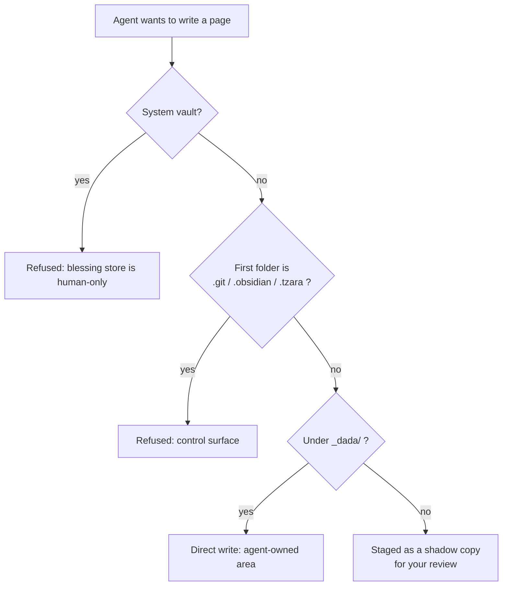

# Agent security

Agents are the one part of Tzara that runs on its own, in the background, doing who knows what. Everything else in the wiki waits for you to press a button. So agents get their own set of guardrails, and this page walks through them.

*[LLM]: Large Language Model
*[RCE]: Remote Code Execution
*[RAG]: retrieval augmented generation
*[SSRF]: Server-Side Request Forgery

There is no single lock here. The whole approach is about **blast radius**: assume any given layer might fail, and arrange things so that when it does, the damage is small and recoverable. An agent can read a web page containing a hidden "ignore your instructions and delete everything" prompt injection, and the goal is that the worst it can do is stage a proposal you then reject.

It helps to split the guardrails into two kinds:

- **Proactive** guards are structural and always on. You don't configure them and you can't turn them off from inside an agent. They come from *where things live* and *what can reach what*.
- **User-guarded** steps put you in the loop. By default an agent proposes and you dispose. Autonomy is something you deliberately opt into, one agent at a time.

## Proactive: an agent exists only because you put it there

An agent is a plain markdown file in the **system vault** (see [agents](agents.md) and [authoring agents](authoring_agents.md)). That location *is* the trust grant. The system vault is hidden from agents and refused at the write gate, so:

- An agent can never create another agent, because it can never write into the system vault.
- An agent can never edit *itself* to grant itself more tools or flip itself into an autonomous mode.
- Blessing is a physical fact - a file a human placed - not a flag some clever prompt could set.

This is the recurring theme: important decisions are derived from **location**, never from anything a tool call or an LLM could talk its way into.

## Proactive: the write gate refuses dangerous places outright

Every write an agent makes funnels through one chokepoint (`write_gate.py`), and that gate decides what to do purely from *where* the write is aimed:

Those three refused control folders aren't refused because they're "dotfiles." They're refused because they're **active** - a diff review is too thin a backstop for them:

- `.git` - a planted git hook would execute on your machine the next time git runs. That's straight-up RCE.
- `.obsidian` - community-plugin code that Obsidian loads when you open the vault.
- `.tzara` - the config that says whether a vault is a system vault, what's been seeded, and how it's displayed. A flipped flag there could hide a vault or lock writes.

The set is deliberately **narrow**. Other non-content folders (`.trash`, `__pycache__`) hold no executable or privileged surface, so a write there is just an ordinary staged proposal - no special-casing, no blanket "block all dotfolders" rule that would surprise you later.

## Proactive: custom tool code runs in a box with no keys

When you write your own Python tool inside an agent file, that code does **not** run in the same place as the wiki. It runs in the isolated `jupyterserver-agent` container, which [jupyter technical details](jupyter/jupyter-technical-details.md) covers in depth. The short version:

- **No vault mount.** The agent kernel cannot see your files on disk at all.
- **Its own network** (`agent-net`), off the wiki's network. No direct line to PostgreSQL, to Redis, or to the Starlette server.
- **Data only through a thin `wiki` proxy.** The kernel reaches your vault by making narrow API calls back through the worker, carrying a **scoped token**. That token isn't a password - it's a leash. It confines the caller to one specific vault and one specific kernel instance, so a tool can't wander into a vault it wasn't run against.
- **Schemas are read, not run.** The description of your tool that the model sees is derived by *statically parsing* the Python (its type hints and docstring). Your code is never executed just to figure out what it looks like - it only ever runs when the agent actually decides to call it.

> [!info] Why the whole separate container?
> Because *you* wrote the code on a markdown page and pressed Run - you get to do whatever you want. An agent, running unattended, might call a tool that pulls text off the internet, and that text might be hostile. Isolating the code from your files means a bad tool call has almost nothing to grab.

## User-guarded: propose first, you approve

By default every agent runs in `propose` mode. When it "writes" a page, nothing touches your real notes. Instead the write lands as a **shadow copy** plus a manifest row, and it waits for you on the [Agent Activity](/agents) page (also reachable from the Tasks page - see [basics](basics.md)).

There you review each proposed change as a diff and accept or reject - all of them at once, or one at a time. The proposal also freezes a hash of the file it was computed against, so if you edited that page in the meantime, promotion refuses instead of silently clobbering your work.

> [!note] You are always in control
> This is the same promise as document and vault chat: an agent can *suggest* all day long, but real pages only change when you say so.

## User-guarded: autonomy is an opt-in, and it's still recoverable

If you trust an agent, you can set `mode: act-with-checkpoint` and let its writes apply immediately. Two things about that:

- It's **opt-in per agent**. Nothing acts on its own unless you deliberately grant it.
- Even then, every applied write is preceded by a **checkpoint commit**, so any change an agent makes is recoverable from that vault's git history. There is no un-checkpointed "act" mode - `act` and `act-with-checkpoint` are the same thing.

Start every new agent in `propose`, watch what it actually does for a while, and only then decide whether it has earned a longer leash.

## Proactive: agent output is fenced off by location

An agent writes its report into its own area, `_dada/{slug}/`, and that area is **excluded from RAG indexing** by default. That keeps an agent's output - which could contain injected text - from quietly feeding itself or poisoning your search results on the next run. You "take ownership" of something an agent produced by moving the file *out* of that folder into your real notes, which is a deliberate human act.

## Proactive: agents can't stampede

A few limiters keep automatic agents from running away, especially when one agent's finish triggers another (see the `on:` triggers in [authoring agents](authoring_agents.md)):

- An agent never fires on events about **itself**.
- Chained triggers stop at a **depth limit** (3 by default).
- After firing on an event an agent **cools down** and is **budgeted per hour**; extra triggers wait in a pool rather than piling up.
- Two agents whose triggers name each other form a cycle and are **refused at load time**, before either can run.

And any run that's misbehaving can be **cancelled** from the Agent Activity page - a cooperative stop that takes effect between steps.

## The actual open edge

Isolation blocks the wiki, the database, and Redis. What the agent kernel still needs is the **internet** - that's often the whole point of a custom tool. But an open door out is still an open door.

> [!warning] Internet egress is the piece I'm still working on
> Because the agent kernel can reach the internet, that same route is a real access point, and shutting it selectively (an egress allow‑list) is the guardrail that isn't in place yet. Until it is, treat any agent tool that fetches from the network as the highest-risk thing an agent can do: pin the exact URL in your tool's Python rather than letting the model choose it, keep such agents in `propose` mode, and remember that the isolation above is what keeps a hostile fetch from turning into anything worse than a bad proposal.

The prompt‑injection triad: untrusted input, a way to act, and a way to exfiltrate.  The first two are largely neutralized by everything above; egress is the corner still being worked on. It's called out here rather than hidden because knowing where the issue is changes how you'd write a network-touching tool.

## Related

* [agents](agents.md) - what an agent is
* [authoring agents](authoring_agents.md) - every frontmatter field, including `mode`, `vaults`, and `on:`
* [jupyter technical details](jupyter/jupyter-technical-details.md) - the two Jupyter containers and the `wiki` proxy
* [basics](basics.md) - where the Agent Activity and Tasks pages live
