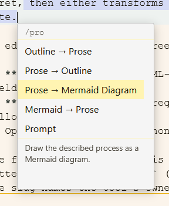

* [help](../help.md)
    * [configurations](configurations.md) - How (and where) to configure things.
    * [basics](basics.md) - The basics of using Tzara.
    * [markdown-syntax](markdown-syntax.md) - The markdown you’ll use every day, shown by example.
    * [frontmatter](frontmatter.md) - The metadata block at the top of a page, and what Tzara does with it.
    * [jupyter](jupyter.md) - Jupyter integration details and examples.
    * [agents](agents.md) - Creating agents and how they work
    * **editors** - Custom “/” menu commands that transform text as you edit

# What are editor tools?

> "Agent is to Agentic as Editor is to Editoric."
> -- Joe Coleman, circa 2026.

{: style="float:right;border:3px double var(--base-color);padding:1em;margin:0.25em;"}

An **editor** tool is a saved command you run from the **"/" menu while editing a page**. You select some text - or select nothing and just leave the caret where you want new text - then type `/` (or press `Ctrl+Shift+/`, which works anywhere, including mid-word), pick your tool, and an LLM does something useful: rewrites it, reformats it, writes the missing paragraph, or files it away as a note.

The strip along the bottom of the menu describes whichever tool is highlighted, so you can arrow through the list and read what each one does before committing to it. That text is the tool's `description` - see [authoring editors](authoring_editors.md).

If an [agent](agents.md) is an LLM that talks to itself in the background to tend your whole vault, an editor tool is the opposite: it's an LLM you reach for **in the moment**, pointed at exactly the text in front of you, with the result handed straight back to you to accept or reject.

*[LLM]: Large Language Model

# What they can do

Every editor tool has a **prompt** (what to do with the text), a **scope** (what text it looks at - the selection, the whole document, or the area around your caret), and an **operation** (what to do with the result):

- **replace** what the tool looked at - "rewrite this in plain English", "fix the grammar", "turn this into a table". With nothing selected, this replaces the paragraph your caret is sitting in.
- **prepend** or **append** - put the result before or after it. "Write a lede for this section", "add a TL;DR at the top", "extract the key points and list them at the end".
- **insert** at the caret exactly - "continue this sentence", "write the paragraph that bridges these two". A caret-scoped tool sees the document on both sides of the caret, so it can write something that fits *between* what comes before and what comes after, not just something that follows on.
- **note** - leave the document untouched and instead append the result to a growing external digest - "add this passage to my reading journal", "collect these characters into a glossary".

Tools can also be given a couple of **read-only search tools**, or **custom Python functions you write**, and can keep **memory** across invocations so a note-taking tool assimilates what it has seen over many runs and many documents.

# The building blocks

An editor tool is a single markdown file. At minimum it needs:

1. A `type: editor` frontmatter block with a `label` and an `operation`.
2. A `# Prompt` describing the transform.

That's it - a two-line frontmatter and a prompt is a complete, working tool. Everything else (search tools, Python tools, notes, memory) is optional.

# Examples

The system vault ships a few example editors under `editors/`. Open any of them to read its definition:

- **British Spelling** / **Secretary** - pure-prompt transforms (no tools).
- **Decoder Ring** - a custom Python tool (ROT13) run in the isolated kernel.
- **Add to Glossary** / **Research Note** - `operation: note` tools that keep a growing, memory-assimilated digest.

# Seeing what is installed

The **[/editors](/editors)** page lists every editor tool with its description, its settings, and whether it's valid - including *why* an invalid one was rejected (a frontmatter mistake or a Python syntax error). It's the editor-tool counterpart to the `/agents` view.

# Making your own

* [authoring editors](authoring_editors.md) - reference details for every field, the `editor` and `wiki` objects, memory, and validation.
* [the wiki object](wiki-object.md) - the corpus-access object your custom Python tools use.

# Skillz, a comparison

These Editor tools have a superficial resemblance to the Skill files popularized by Anthropic.  They both wrap reusable LLM behavior into a simple text file a human can edit.  However, they differ in the following ways:

* A Skill is routed by a model, so the model determines when to use it based on trigger style language.  An Editor, by comparison, is human routed.
* Skills have a lazy loading mechanism because they compete for space in a context window.  Tzara's Editors don't have that problem because only one tool runs at a time, which is great for small, local LLMs.  The architecture needed for a Skill is absent.
* An Editor has a typed I/O contract versus a Skill's open ended instructions.  An editor declares input and output in the frontmatter via that `scope:` (what text is handed in) and `operation:` (where the result goes) fields.  This makes the Editor resemble a pure function, `text -> text`, where the editor determines placment, not the model.   A skill is a behavior modifier.
* Skills inherit the permissions of their calling agent, so their safety gate is the permission prompt attached to some underlying tool, such as Bash.  Tzara shifts the safety gate to the output where each result appears behind an accept/reject prompt.  Escalation works differently as well: skill scripts run through the agent’s Bash at the agent’s trust level, whereas Tzara’s Python runs in an isolated Jupyter‑agent kernel, with schemas generated by `ast.parse` and no execution at registration.
* Skills are stateless because their folder is read-only content, and nothing carries across sessions.  Editors can have `memory: true`, so an Editor can learn your style accross documents.
* Skills stay around in an agent's loop, Editors are synchronous and have a defined termination condition.
* Skills are portable, Editors are Tzara specific.
* Editors are wiki pages and are first class artifacts, skills not so much.

# Related
- [agents](agents.md) - the background counterpart to editor tools
- [Main](../Main.md)
