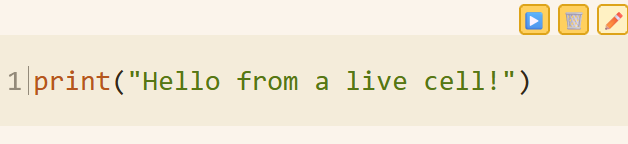

Tzara supports inline python execution via a jupyter server.  If you have a snippet of python code, you can mark it as executable by denoting it as a `jupyter` block in your markdown.

````markdown
```jupyter
print("Hello from a live cell!")
```
````

That renders on the page as a live cell with a Run button ▶️, as you can see in the image below

{: .img-center title="Image of a rendered jupyter code block showing the Run, Clear Output, and Edit buttons." style="border:1px inset var(--darker);padding:var(--space-lg); border-radius: var(--radius-md);" }

> [!warning]
> Executable cells run in a Jupyter kernel that has access to your vaults. Only run code you understand or wrote yourself.

There are some rather significant differences in implementation here, mainly opinionated philosophy driven. 

## Kernel lifetime

A running jupyter kernel is ephemeral, lasting only about an hour after last activity.  There is a scheduled reaper that kills any jupyter kernels not being interacted with.  So, if you run some code on a page, after roughly an hour of inactivity the kernel is killed and the page will display a message on any "cell" you may have executed alerting you that the kernel is disconnected.

## Running and clearing output

All the cells on a page share one kernel, so a variable you define in one cell is still in scope in the next.

Running a block of code, using the Run button ▶️, will replace the code with the code's output. You can clear the output by clicking the Clear Output button 🗑️.  Output is not saved and does not become part of the markdown file.

## Editing code

There are two ways to edit code, and only one is permanent.  Editing the markdown of a document is the only way to save any python code you may have written. That's just the normal editing a document workflow.  The non-permanent method of writing code is to click the pencil button that appears when hovering your mouse over a `jupyter` code block.  This is an inline page edit, and from the inline edit state, clicking the edit button ✏️ takes you out of the inline edit and formats the code, the Clear Output button 🗑️ will reset the code you just modified to the original state of what's in the markdown file on disk, and the Run button ▶️ will execute what you just wrote.  This is great for temporary code you only want to run once.  As an example, you might have some code referencing a python library that's not installed, so you get an error message when trying to run the code, so just hit the edit button, erase everything and type `pip install your missing library`, click the Run button ▶️ to actually install it, then click clear output to reset the cell back to its original state, then run your super awesome code now with your library installed. 

## The `wiki` object

Every page kernel is handed a `wiki` object, scoped to the vault the page lives in.  It has methods for search, backlinks, tags, frontmatter, and a few vault-wide reports, which means a page can report on your own notes.  See [the wiki object](wiki-object.md) for the full method reference, and [jupyter technical details](jupyter/jupyter-technical-details.md) for the two-container design.

## Related
* [wiki object](wiki-object.md)
* [jupyter examples](jupyter/jupyter-examples.md)
* [jupyter more examples](jupyter/jupyter-more-examples.md)
* [jupyter technical details](jupyter/jupyter-technical-details.md)