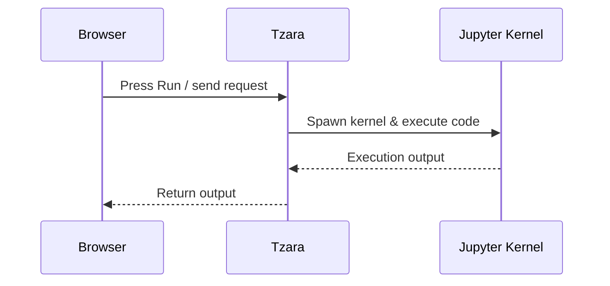
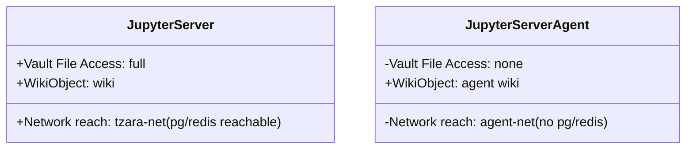
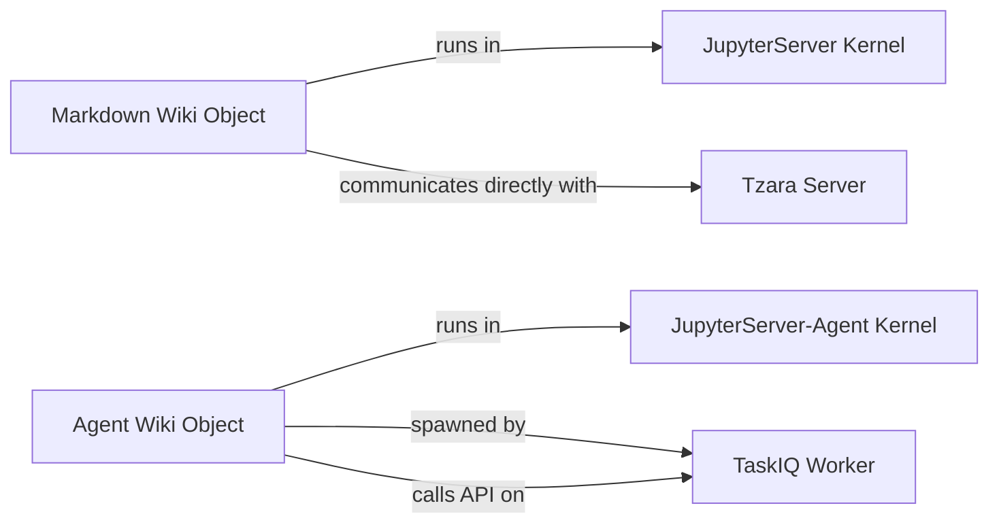

# Containers

There are two jupyter containers in this project.  They're both built from the same image, so any python packages one has, the other will have as well.  You can change this, of course. 

One container is for user initiated code execution on a markdown page.  The other container is for custom agent tool execution. 

## But why two?

Jupyter was initially added so I could have some nice interactive code in a markdown page.  That's the `jupyterserver-1` container.  Any time you put a `jupyter` code block on a page, and you click the "Run" button, a jupyter kernel is launched specific to that page, the code gets executed, and output is displayed. 



In this configuration, Tzara is a proxy or translation layer into Jupyter.  Currently, only a small subset of Jupyter features are supported, but it's enough to do some fun things.  Downside is that those fun things have to be manually added to be supported, such as widgets and some plotting libraries.  Things may be a little rough around the edges.  

So, both jupyter containers are isolated. No open ports.

The other Jupyter container is for running custom agent tools. See [authoring agents](../authoring_agents.md) for implementation details on how to create an agent.  Agents, in this application, are simply plain markdown files with a prompt and an initial kickoff or starting message and a tool.  The agents have access to a curated and whitelisted set of tools.  However, as the Python expert that you are, you can provide your own tools as python functions.  When python code is detected in an agent markdown file, the name and description are provided to the LLM, and if the task at hand needs to call the function, the `jupyterserver-agent-1` container is used for isolated code execution. Tools specific to Tzara are run in the worker instance, not in jupyter. 

The difference between jupyterserver and jupyterserver-agent is as follows: jupyterserver has full vault file access, is on the tzara-net network, has access to wiki object.  The jupyterserver-agent does NOT have access to vault files, is on the agent-net network, and has access to a different wiki object specific for agents.



So those are the differences, and to answer **why** there are two jupyter containers, it's because the code you put in a markdown file is done by you.  You have to press the "Run" ▶️ button.  

Agents, on the other hand, are running in the background doing who knows what.  So, this separation and isolation is one of many attempts at trying to mitigate any damage or issues if an agent does something unwanted. 

If you write code in a markdown page, you can have it do anything you want.  There is utility with this.  For agents, you could theoretically write a function that grabs information from a web source, and if that source contains a prompt injection, then who knows what could happen.  So, we isolate your files from the container.  

The internal docker networks, **tzara-net** and **agent-net** are used to isolate agent code access to the database and redis server as well as isolate it from the starlette server, so no internal access, only internet access[^1].

[^1]: With internet access, technically there is still an access point that is open. It's very convoluted, and I'm still thinking about how I want to handle it. This is also mentioned on the [agent security](../agent-security.md) page.

# The `wiki` object

For every markdown page kernel there is a `wiki` object, and a different object, but still named `wiki`, for custom agent tools.  

The markdown page `wiki` object has methods for search, related, tagged, backlinks, frontmatter, query documents, edges, document tags, list orphans, find near duplicates, find missing links, and list stale stubs, all bound to the vault the page is in. 

The agent `wiki` object, again, tied to a specific vault at runtime, can do everything the other wiki object can do.  However, this agent wiki object can also read pages and stage a write operation for human review. 

```jupyter
dir(wiki)
```

See `jupyter_client.py` and `agent_kernel.py` for implementation details.  These objects are always available as they are inserted automatically when a python kernel is created.  For the agent wiki object, it is provided a token on instantiation that it uses for an agent specific api point in a taskiq worker that marshalls calls to the server.  The token is not for authentication, but for confining the caller to a specific vault and to a specific kernel instance. 



## Where to go next

The methods of the `wiki` object return plain lists/dicts, so you can drop the output straight into a DataFrame - handy for a live vault dashboard written in Python:

```jupyter
import pandas as pd
pd.DataFrame(wiki.tagged("help"))
```

For the **full method reference** - every query and analysis view, and (on the agent `wiki`) page reads, staged writes, and the argument-coercion helpers - see [the wiki object](../wiki-object.md).


## Isn't this a bit over-engineered? 
Perhaps.

## Related

* [jupyter](../jupyter.md) 
    * [jupyter examples](jupyter-examples.md)
    * [jupyter more examples](jupyter-more-examples.md)
- [help](../../help.md)
